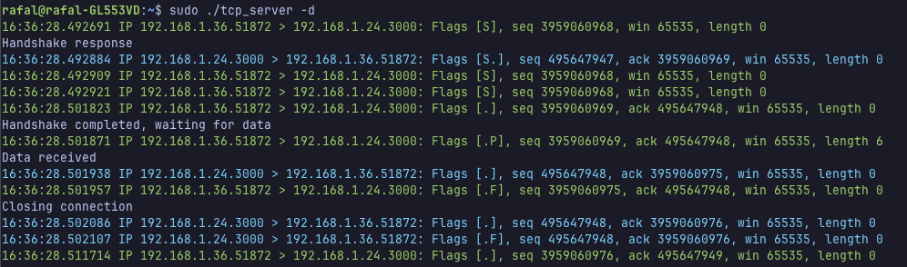

# Raw‑Socket TCP Server

A TCP server implemented in **C** that bypasses the kernel’s TCP stack by communicating directly with the network using raw sockets. The program manually parses Ethernet, IPv4, and TCP headers, maintains its own finite-state machine for the three-way handshake, consumes all client payloads, and gracefully terminates the connection with a proper four-way FIN/ACK sequence.

> ⚠️ **Root required** – the server handles packets below the transport layer.

----------

## Contents

1.  [Key capabilities](#key-capabilities)

2.  [Build & run](#build--run)

3.  [Command‑line flags](#commandline-flags)

4.  [Kernel tweaks](#kernel-tweaks)

5.  [Example session](#example-session)

6.  [Developing & testing](#developing--testing)

----------

## Key capabilities

-   **Header‑level control** – constructs and validates Ethernet, IPv4 and TCP headers (checksums included).

-   **Full TCP FSM** – SYN / SYN‑ACK / ACK, retransmission debounce, FIN / ACK shutdown.

-   **Observability built‑in**

    -   `--verbose` dumps colourised headers layer‑by‑layer.

    -   `--debug` prints tcpdump‑style lines for TX/RX packets and state transitions.

-   **Single‑session mode** for deterministic integration tests.

-   **Zero external deps** – the only requirement is a C99 compiler and Linux headers.


----------

## Build & run

```bash
# Allow experimental TCP connections 
$ sudo iptables -A OUTPUT -p tcp --tcp-flags RST RST -j DROP

# Compile 
$ make 

# Start the server on port 3000 with debug output
$ sudo ./tcp_server -d

# From another host / shell send message to the server
$ echo "Hello" | nc <server‑ip> 3000

```

----------

## Command‑line flags

```text
Usage: tcp_server [options...]
  -h, --help            Show this help and exit
  -v, --verbose         Dump every header field in colour
  -d, --debug           tcpdump‑like TX/RX log + state machine trace
  -s, --single-session  Exit after the first completed connection

```

----------

## Kernel tweaks

**Outgoing RST kills handshake**\
\
Some hardware / kernel defaults interfere with raw‑socket experiments.  
You need to drop outgoing RST packets to keep your experimental TCP connections alive even when the OS would normally kill them.

`sudo iptables -A OUTPUT -p tcp --tcp-flags RST RST -j DROP`

> _iptables rule_: the kernel stack sends a RST when it sees an unknown TCP tuple; we discard it so the custom FSM can finish the handshake unharmed.

----------

## Example session



----------

## Developing & testing

### Memory safety

The application has been tested with Valgrind to ensure there are no memory leaks:

```bash
$ sudo valgrind --track-origins=yes --leak-check=full --show-leak-kinds=all ./tcp_server -s
==4604== HEAP SUMMARY:
==4604==     in use at exit: 0 bytes in 0 blocks
==4604==   total heap usage: 25 allocs, 25 frees, 328,313 bytes allocated
==4604==
==4604== All heap blocks were freed -- no leaks are possible
==4604== ERROR SUMMARY: 0 errors from 0 contexts (suppressed: 0 from 0)

```

### Build system

This project uses a Makefile with the following targets:

-   `make` – build the main `tcp_server` executable

-   `make test` – build and run unit tests (Unity framework)

-   `make clean` – remove all build artifacts

-   `make format` – apply `clang-format` to all source files

-   `make format-check` – verify code style without modifying files

